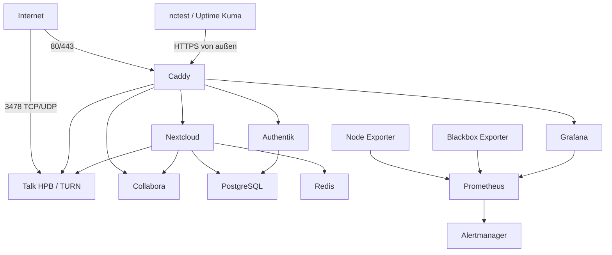

# 03 – Architektur

## Netzwerkübersicht

## Frontend-Netz

`zircula_frontend` verbindet Caddy mit Nextcloud, Collabora, Authentik, Grafana
und Talk HPB. Nur Caddy veröffentlicht 80/443; Talk veröffentlicht zusätzlich den
für TURN/STUN benötigten Port 3478 über TCP und UDP.

## Backend-Netz

`zircula_backend` verbindet Nextcloud und Authentik mit PostgreSQL sowie Nextcloud
mit Redis. Es ist ein internes gemeinsames Vertrauensnetz. Datenbankrollen und
Redis-Authentifizierung begrenzen den Schaden, falls ein angebundener Container
kompromittiert wird.

## Monitoring-Netz

`zircula_monitoring` verbindet Prometheus mit Grafana, Alertmanager, Node
Exporter und Blackbox Exporter. Nur Grafana ist zusätzlich im Frontend-Netz.
Prometheus, Alertmanager und Exporter besitzen keine öffentlichen Hostports.

Uptime Kuma läuft getrennt auf nctest und prüft die öffentlichen HTTPS-Endpunkte.
nctest ist keine hochverfügbare Infrastruktur; diese Außenüberwachung ist daher
als Übergangslösung dokumentiert.

## Persistenz

Produktive Daten liegen unter `/srv/zircula`. Compose-Dateien, Vorlagen und
Betriebsdokumentation liegen im Repository unter
`/opt/zircula/git/infrastructure`.

Hostbezogene Stacks außerhalb des VPS werden unter `hosts/<hostname>`
dokumentiert. Laufzeitdaten und Secrets bleiben auf dem jeweiligen Host.

## Domainstrategie

| Dienst | Domain |
|---|---|
| Nextcloud | `cloud.zircula.org` |
| Collabora | `office.zircula.org` |
| Authentik | `auth.zircula.org` |
| Grafana | `monitoring.zircula.org` |
| Talk HPB | `talk.cloud.zircula.org` |
| VPS/SSH | `vps.zircula.org` |

Die öffentliche URL bleibt von der konkreten Containerimplementierung getrennt.
