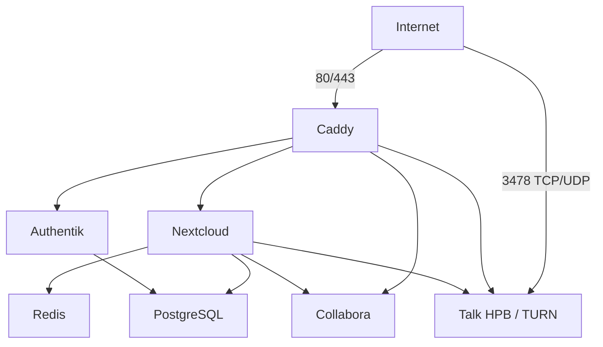

# 03 – Architektur

## Netzwerkübersicht

## Frontend-Netz

`zircula_frontend` verbindet Caddy mit Nextcloud, Collabora, Authentik und Talk
HPB. Nur Caddy veröffentlicht 80/443; Talk veröffentlicht zusätzlich den für
TURN/STUN benötigten Port 3478 über TCP und UDP.

## Backend-Netz

`zircula_backend` verbindet Nextcloud und Authentik mit PostgreSQL sowie Nextcloud
mit Redis. Es ist ein internes gemeinsames Vertrauensnetz. Datenbankrollen und
Redis-Authentifizierung begrenzen den Schaden, falls ein angebundener Container
kompromittiert wird.

## Persistenz

Produktive Daten liegen unter `/srv/zircula`. Compose-Dateien, Vorlagen und
Betriebsdokumentation liegen im Repository unter
`/opt/zircula/git/infrastructure`.

## Domainstrategie

| Dienst | Domain |
|---|---|
| Nextcloud | `cloud.zircula.org` |
| Collabora | `office.zircula.org` |
| Authentik | `auth.zircula.org` |
| Talk HPB | `talk.cloud.zircula.org` |
| VPS/SSH | `vps.zircula.org` |

Die öffentliche URL bleibt von der konkreten Containerimplementierung getrennt.

