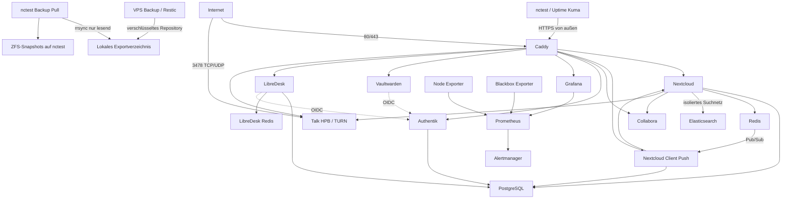

# 03 – Architektur

## Netzwerkübersicht

## Frontend-Netz

`zircula_frontend` verbindet Caddy mit Nextcloud, Client Push, Collabora,
Authentik, Grafana, Vaultwarden, LibreDesk und Talk HPB. Nur Caddy veröffentlicht 80/443; Talk veröffentlicht
zusätzlich den für TURN/STUN benötigten Port 3478 über TCP und UDP.

## Backend-Netz

`zircula_backend` verbindet Nextcloud, Client Push, Authentik und LibreDesk
mit PostgreSQL, Nextcloud und Client Push mit ihrem gemeinsamen Redis sowie LibreDesk mit dem getrennten LibreDesk-Redis. Es ist ein internes gemeinsames Vertrauensnetz. Datenbankrollen und
Redis-Authentifizierung begrenzen den Schaden, falls ein angebundener Container
kompromittiert wird.

## Suchnetz

`zircula_search` verbindet ausschließlich Nextcloud und Elasticsearch. Das Netz
ist intern, besitzt keinen Hostport und ist weder mit Caddy noch mit dem
gemeinsamen Backend-Netz verbunden. Der extrahierte Dokumenttext im Suchindex
bleibt dadurch außerhalb anderer Anwendungscontainer. Elasticsearch ist eine
regenerierbare Hilfsplattform und keine Primärdatenquelle.

## Monitoring-Netz

`zircula_monitoring` verbindet Prometheus mit Grafana, Alertmanager, Node
Exporter und Blackbox Exporter. Nur Grafana ist zusätzlich im Frontend-Netz.
Prometheus, Alertmanager und Exporter besitzen keine öffentlichen Hostports.

Uptime Kuma läuft getrennt auf nctest und prüft die öffentlichen HTTPS-Endpunkte.
nctest ist keine hochverfügbare Infrastruktur; diese Außenüberwachung ist daher
als Übergangslösung dokumentiert.

## Persistenz

Produktive Daten liegen unter `/srv/zircula`. Vaultwardens SQLite-Datenbank,
Schlüssel und Anhänge liegen gemeinsam unter `/srv/zircula/vaultwarden/data`.
LibreDesk-Uploads liegen unter `/srv/zircula/libredesk/uploads`; Tickets und
Konfiguration liegen in der getrennten PostgreSQL-Datenbank. LibreDesk-Redis
persistiert ergänzenden Queue-/Cachezustand unter `/srv/zircula/libredesk-redis`.
Compose-Dateien, Vorlagen und Betriebsdokumentation liegen im Repository unter
`/opt/zircula/git/infrastructure`. Der regenerierbare Elasticsearch-Index liegt
unter `/srv/zircula/elasticsearch` und wird bewusst nicht als primäre
Wiederherstellungsquelle gesichert.

Hostbezogene Stacks außerhalb des VPS werden unter `hosts/<hostname>`
dokumentiert. Laufzeitdaten und Secrets bleiben auf dem jeweiligen Host.

## Backup-Architektur

Der VPS erzeugt unter `/opt/zircula/backups/export/restic` ein clientseitig
verschlüsseltes Restic-Repository. Vor der Sicherung werden PostgreSQL logisch,
Vaultwarden mit seinem eingebauten Backupverfahren und Grafana über die
SQLite-Backup-API konsistent gesichert. Nextcloud befindet sich während des
kritischen Sicherungsabschnitts im Wartungsmodus.

Ein dedizierter SSH-Benutzer stellt ausschließlich dieses verschlüsselte
Exportverzeichnis über einen erzwungenen `rrsync -ro`-Befehl bereit. nctest
initiiert die Übertragung, besitzt auf dem VPS weder Shell- noch Schreibrechte
und speichert den Spiegel im eigenen ZFS-Dataset. Nach einer vollständigen
Übertragung wird ein ZFS-Snapshot angelegt. Der Restic-Schlüssel wird nicht auf
dem Transportweg mitgegeben, sondern getrennt offline an mindestens zwei
kontrollierten Orten verwahrt.

Das lokale Repository auf dem VPS ermöglicht schnelle Prüfungen und Restores,
ist aber keine unabhängige Sicherung. Die nctest-Kopie ist das vorläufige externe
Ziel; wegen Stromversorgung, Standort und gelegentlichem Ausschalten bleibt ein
dauerhaftes zweites Ziel eine spätere Ausbaustufe. Technische Details,
Aufbewahrung und Restore-Verfahren stehen in `docs/07-backup-restore.md` und
`backup/README.md`.

## Domainstrategie

| Dienst | Domain |
|---|---|
| Nextcloud | `cloud.zircula.org` |
| Collabora | `office.zircula.org` |
| Authentik | `auth.zircula.org` |
| Grafana | `monitoring.zircula.org` |
| Vaultwarden | `vault.zircula.org` |
| LibreDesk | `support.zircula.org` |
| Talk HPB | `talk.cloud.zircula.org` |
| VPS/SSH | `vps.zircula.org` |

Die öffentliche URL bleibt von der konkreten Containerimplementierung getrennt.
