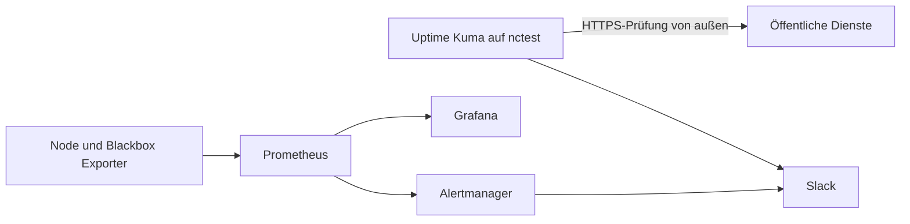

# 10 – Monitoring

## Ziel und Abgrenzung

Das Monitoring trennt Außenverfügbarkeit, interne Ursachenanalyse und
Benachrichtigung:



Uptime Kuma ist vorläufig auf nctest untergebracht. Da nctest ausgeschaltet
werden kann, ist dies keine hochverfügbare externe Überwachung. Nach einer
organisatorischen Entscheidung wird mindestens ein unabhängiger externer
Heartbeat oder Monitoringstandort ergänzt.

Prometheus, Alertmanager und Grafana laufen auf demselben VPS wie die
Produktivdienste. Sie liefern Ursachenanalyse und historische Werte, können aber
einen vollständigen VPS-Ausfall nicht selbst nach außen melden.

## Umsetzungsstand vom 24.07.2026

Auf dem VPS ausgerollt und geprüft sind Node Exporter, Blackbox Exporter,
Alertmanager, Prometheus und Grafana. Bestätigt wurden:

- Hostmetriken und ausschließlich lesende Mounts im Node Exporter
- erfolgreiche HTTP-, TLS- und Zertifikatsprüfung durch Blackbox Exporter
- validierte Prometheus-Konfiguration, sechs Regeln und sieben erreichbare Targets
- vier erfolgreiche öffentliche Probes
- Alertmanager-Readiness und ein in Slack angekommener manueller Testalarm
- Grafana-Health, provisionierte Prometheus-Datenquelle und VPS-Dashboard
- lokaler Grafana-Break-Glass-Login
- Authentik-OIDC mit erfolgreichem Admin-Rollenmapping
- Abweisung nach Entitlement-Entzug sowie vollständiger Grafana-/Authentik-Logout
- öffentliche Erreichbarkeit ausschließlich von Grafana über Caddy
- rootless Uptime Kuma auf dem lokalen ZFS-Dataset von `nctest`
- Zugriff auf Uptime Kuma ausschließlich über Tailscale Serve auf HTTPS-Port 8443
- vier erfolgreiche externe Dienstprüfungen sowie getestete Slack-DOWN- und
  Entwarnungsnachrichten

Das VPS-Dashboard ist als Grafana-Startseite ausgerollt und wird nach dem
Authentik-Login direkt angezeigt. Ein temporärer Benutzer ohne
Grafana-Entitlement wurde nach erfolgreicher Authentik-Rückleitung von Grafanas
`role_attribute_strict` abgewiesen; Binding und Testkonto wurden anschließend
entfernt. Rollenentzug und anschließende erneute Anmeldung wurden ebenfalls
abgewiesen. Der Grafana-Logout leitete erfolgreich zum Authentik-End-Session-
Endpunkt weiter; eine stille Wiederanmeldung war danach nicht möglich. Uptime
Kuma auf `nctest` ist mit lokaler SQLite-Datenbank, TOTP für das
Administratorkonto und direkter Slack-Alarmierung ausgerollt.

## Getrennte Stacks

Jedes eigenständige Produkt besitzt einen eigenen Compose-Stack:

| Stack | Aufgabe | Netze | Hostports |
|---|---|---|---|
| `node-exporter` | Hostmetriken | Monitoring | keine |
| `blackbox-exporter` | interne HTTPS-Prüfungen | Monitoring | keine |
| `alertmanager` | Gruppierung und Zustellung von Alarmen | Monitoring | keine |
| `prometheus` | Sammlung, Speicherung und Regeln | Monitoring | keine |
| `grafana` | Dashboards und Auswertung | Frontend, Monitoring | keine |
| `hosts/nctest/docker/uptime-kuma` | externe Verfügbarkeitsprüfung | nctest | nur localhost |

Die Trennung erlaubt unabhängige Updates, Tests und Rollbacks. Das gemeinsame
externe Netz `zircula_monitoring` wird einmalig auf dem VPS erstellt:

```bash
docker network create zircula_monitoring
```

## Öffentlicher Zugriff

Nur Grafana wird über Caddy unter `https://monitoring.zircula.org` veröffentlicht.
Prometheus, Alertmanager und Exporter bleiben ausschließlich intern erreichbar.

Grafana verwendet authentik über Generic OAuth/OIDC. Die Anwendung nutzt
anwendungsspezifische Entitlements:

- `Grafana Admins` → Grafana-Organisationsrolle `Admin`
- `Grafana Editors` → `Editor`
- `Grafana Viewers` → `Viewer`
- kein passendes Entitlement → Anmeldung verweigert

Ein lokaler, von Authentik getrennter Grafana-Serveradministrator bleibt als
Break-Glass-Konto bestehen. OAuth-Auto-Login und das Ausblenden des Loginformulars
werden erst nach dokumentiertem Break-Glass-Test bewertet.

## Secrets und Erstinitialisierung

Secrets werden absichtlich nicht automatisch erzeugt. Automatische Erzeugung bei
jedem Deployment könnte bestehende Schlüssel ersetzen; fest eingebaute
Standardwerte wären unsicher. Stattdessen werden sie einmalig lokal angelegt und
danach außerhalb von Git verwahrt:

| Komponente | Lokale Werte | Ablage |
|---|---|---|
| Node Exporter | keine Secrets | nur Versionswert in `.env` |
| Blackbox Exporter | keine Secrets | nur Versionswert in `.env` |
| Prometheus | derzeit keine Secrets | Aufbewahrungswerte in `.env` |
| Alertmanager | Slack-Webhook | `secrets/slack_webhook_url`, UID/GID 65534 und Modus 400 |
| Grafana | Break-Glass-Zugang, Secret Key, OIDC-Client | `.env`, Modus 600 |
| Uptime Kuma | lokaler Admin und Slack-Webhook | Laufzeitdatenbank auf nctest |

Das Kopieren einer `.env.example` erzeugt nur die dokumentierte lokale
Konfigurationsdatei. Werte mit `CHANGE_ME` müssen vor dem Start ersetzt werden.
Compose-Dateien erzeugen fehlende Secret-Dateien und besonders sensible
Persistenzpfade nicht stillschweigend.

## Erste Ausbaustufe

Erfasst werden zunächst:

- CPU, RAM, Swap, Load und Netzwerk des VPS
- Dateisystembelegung
- Erreichbarkeit aller Monitoringkomponenten
- öffentliche HTTPS-Endpunkte
- Restlaufzeit der TLS-Zertifikate

Prometheus bewahrt Werte standardmäßig 15 Tage und bis maximal 5 GB auf. Grafana
provisioniert Datenquelle und Basisdashboard aus Git. Das Basisdashboard ist als
Startdashboard konfiguriert, damit der Einzelserver nach dem Login direkt
angezeigt wird.

Anwendungsspezifische Metriken für Nextcloud, Authentik, PostgreSQL, Redis und
Caddy folgen einzeln. Dafür werden keine Datenbankkonten, Docker-Socket-Mounts
oder privilegierten Container vorsorglich angelegt.

## Alarmierung

Prometheus-Regeln werden ausschließlich nach erfolgreicher `promtool`-Prüfung
aktiviert. Alertmanager gruppiert und dedupliziert Alarme und sendet sie zunächst
an Slack. Der Webhook liegt in einer lokalen Secret-Datei und nicht in Git oder
Container-Umgebungsvariablen.

Uptime Kuma alarmiert unabhängig direkt an Slack. Dadurch bleibt die externe
Verfügbarkeitsmeldung von Prometheus getrennt. Ein späterer Wechsel zu Nextcloud
Talk erfolgt über einen Webhook beziehungsweise Bot, ohne die Messwerterfassung
neu aufzubauen.

Alarmtests stoppen keine Produktivdienste. Verwendet werden befristete Testregeln
oder absichtlich nicht existierende Testziele.

## Datenschutz und Sicherheit

- keine öffentlichen Metrik- oder Administrationsports außer Grafana über Caddy
- kein Docker-Socket in einem Monitoringcontainer
- nur lesende Host-Mounts für Node Exporter
- keine Dateinamen, Benutzernamen, URLs mit Tokens oder andere hochkardinale
  Nutzdaten als Prometheus-Labels
- Secrets ausschließlich lokal und mit dienstbezogen minimalen Leserechten
- keine vollständigen Requestpfade oder Inhalte in Dashboards
- Zugriff auf Grafana nur für ausdrücklich berechtigte Authentik-Entitlements
- MFA für Grafana-Administratoren

Prometheus-Metriken und Grafana-Daten können interne Topologie und Betriebszustand
offenlegen und werden daher wie administrative Daten behandelt.

## Deploymentreihenfolge

1. DNS für `monitoring.zircula.org` setzen.
2. `zircula_monitoring` erstellen.
3. Node Exporter starten und prüfen.
4. Blackbox Exporter starten und prüfen.
5. Alertmanager inklusive lokalem Slack-Secret starten.
6. Prometheus-Konfiguration und Regeln mit `promtool` prüfen und starten.
7. Authentik-Anwendung, Provider und Entitlements vorbereiten.
8. Grafana zunächst intern starten und Break-Glass-Konto testen.
9. Caddy-Konfiguration validieren und Grafana veröffentlichen.
10. OIDC-Rollen, Ablehnung ohne Entitlement, Logout und Dashboards testen.
11. Uptime Kuma auf nctest installieren und Negativtest durchführen.

Jeder Schritt wird einzeln geprüft. Ein fehlerhafter Stack wird zurückgerollt,
ohne die übrigen Monitoringkomponenten neu zu erstellen.

## Grenzen und nächste Stufen

- unabhängiges externes Monitoringziel beziehungsweise Heartbeat
- Backupalter über Node-Exporter-Textfile-Collector
- Nextcloud- und Authentik-Metriken
- PostgreSQL- und Redis-Exporter mit minimal berechtigten Konten
- Caddy-Requestmetriken ohne sensible Pfadlabels
- dokumentierte Alarmverantwortung und Eskalationszeiten
- regelmäßige Prüfung, ob nctest und Uptime Kuma selbst erreichbar sind
